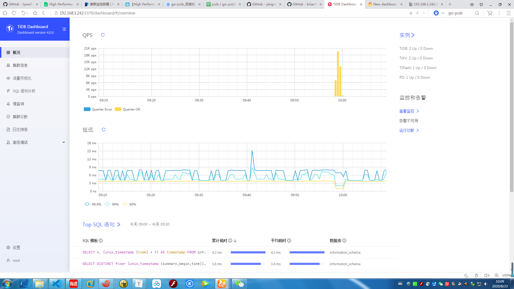
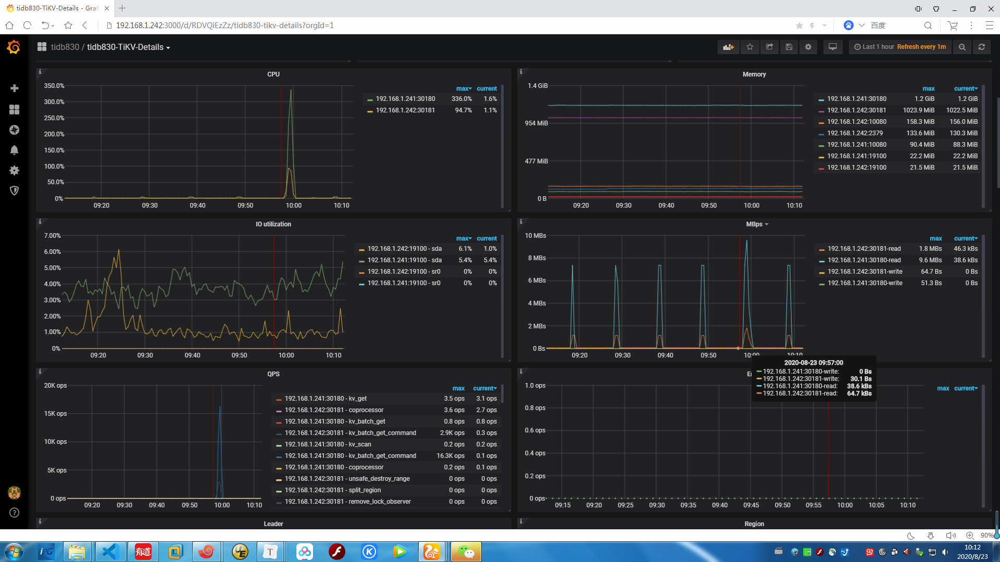

# tidb压测题目

分值：300  题目描述：  使用 sysbench、go-ycsb 和 go-tpc 分别对  TiDB 进行测试并且产出测试报告。  测试报告需要包括以下内容： 

* 部署环境的机器配置(CPU、内存、磁盘规格型号)

* 拓扑结构(TiDB、TiKV 各部署于哪些节点) 

* 调整过后的 TiDB 和 TiKV 配置 

*  测试输出结果记录

* 关键指标的监控截图：

  ​		TiDB Query Summary 中的 qps 与 duration 	   

  ​		TiKV Details 面板中 Cluster 中各 server 的 CPU 以及 QPS 指标 	    

  ​		TiKV Details 面板中 grpc 的 qps 以及 duration

* 输出：写出你对该配置与拓扑环境和 workload 下 TiDB 集群负载的分析，提出你认为的 TiDB 的性能的瓶颈所在(能提出大致在哪个模块即 可)  

* 截止时间：下周二（8.25）24:00:00(逾期提交不给分)


# 部署环境的机器配置(CPU、内存、磁盘规格型号)

## 两台vmwar虚拟机，各8C,16G

```shell
[root@tbase01 ~]# lscpu
Architecture:          x86_64
CPU op-mode(s):        32-bit, 64-bit
Byte Order:            Little Endian
CPU(s):                8
On-line CPU(s) list:   0-7
Thread(s) per core:    1
Core(s) per socket:    8
Socket(s):             1
NUMA node(s):          1
Vendor ID:             GenuineIntel
CPU family:            6
Model:                 44
Model name:            Intel(R) Xeon(R) CPU           E5645  @ 2.40GHz
Stepping:              2
CPU MHz:               2393.703
BogoMIPS:              4788.00
Hypervisor vendor:     VMware
Virtualization type:   full
L1d cache:             32K
L1i cache:             32K
L2 cache:              256K
L3 cache:              12288K
NUMA node0 CPU(s):     0-7
[root@tbase01 ~]# 
[root@tbase01 ~]# free -h
              total        used        free      shared  buff/cache   available
Mem:            15G        345M         13G        628M        2.0G         14G
Swap:            0B          0B          0B
[root@tbase01 ~]# 
```

## 各分配了一块150G虚拟硬盘

```shell
[root@tbase01 ~]# cat /proc/scsi/scsi
Attached devices:
Host: scsi0 Channel: 00 Id: 00 Lun: 00
  Vendor: VMware   Model: Virtual disk     Rev: 2.0 
  Type:   Direct-Access                    ANSI  SCSI revision: 06
Host: scsi3 Channel: 00 Id: 00 Lun: 00
  Vendor: NECVMWar Model: VMware SATA CD00 Rev: 1.00
  Type:   CD-ROM                           ANSI  SCSI revision: 05
[root@tbase01 ~]# 
[root@tbase02 ~]# lsscsi 
[0:0:0:0]    disk    VMware   Virtual disk     2.0   /dev/sda 
[3:0:0:0]    cd/dvd  NECVMWar VMware SATA CD00 1.00  /dev/sr0 
[root@tbase02 ~]# hdparm -i /dev/sda
/dev/sda:
SG_IO: bad/missing sense data, sb[]:  70 00 05 00 00 00 00 0a 00 00 00 00 20 00 00 c0 00 00 00 00 00 00 00 00 00 00 00 00 00 00 00 00
 HDIO_GET_IDENTITY failed: Invalid argument
[root@tbase02 ~]# 
```

## 测试硬盘

###  随机同步写入性能 

```SHELL
[root@tbase02 ~]# time dd if=/dev/zero of=/tmp/test bs=8k count=51200 oflag=dsync 
51200+0 records in
51200+0 records out
419430400 bytes (419 MB) copied, 138.307 s, 3.0 MB/s

real	2m18.315s
user	0m0.106s
sys	0m4.403s
[root@tbase02 ~]# 
```

### 批量写入性能

```shell
[root@tbase02 ~]# time dd if=/dev/zero of=/tmp/test4 bs=8k count=51200 conv=fsync
51200+0 records in
51200+0 records out
419430400 bytes (419 MB) copied, 2.04958 s, 205 MB/s

real	0m2.051s
user	0m0.011s
sys	0m0.541s
[root@tbase02 ~]#
```

### 读出性能 

```shell
[root@tbase02 ~]# free -m
              total        used        free      shared  buff/cache   available
Mem:          15886        1324        4974        1008        9587       13194
Swap:             0           0           0
[root@tbase02 ~]# echo 3 > /proc/sys/vm/drop_caches 
[root@tbase02 ~]# free -m
              total        used        free      shared  buff/cache   available
Mem:          15886        1323       13386        1008        1176       13290
Swap:             0           0           0
[root@tbase02 ~]# time dd if=/tmp/test of=/dev/null bs=8k count=51200 oflag=dsync 
51200+0 records in
51200+0 records out
419430400 bytes (419 MB) copied, 2.06349 s, 203 MB/s

real	0m2.092s
user	0m0.010s
sys	0m0.342s
[root@tbase02 ~]# 
```


## 拓扑结构(TiDB、TiKV 各部署于哪些节点) 

```shell
[root@tbase02 ~]# cat wei_tidb_241and242.yaml 
# # Global variables are applied to all deployments and used as the default value of
# # the deployments if a specific deployment value is missing.
global:
 user: "tidb"
 ssh_port: 22
 deploy_dir: "/tidb-deploy830"
 data_dir: "/tidb-data830"
    
# # Monitored variables are applied to all the machines.
monitored:
 node_exporter_port: 19100
 blackbox_exporter_port: 19115
    
server_configs:
 tidb:
   log.slow-threshold: 300
 tikv:
   readpool.storage.use-unified-pool: false
   readpool.coprocessor.use-unified-pool: true
 pd:
   replication.enable-placement-rules: true
 tiflash:
   logger.level: "info"
    
pd_servers:
 - host: 192.168.1.242
    
tidb_servers:
 - host: 192.168.1.241
 - host: 192.168.1.242
    
tikv_servers:
 - host: 192.168.1.241
   port: 30160
   status_port: 30180
    
 - host: 192.168.1.242
   port: 30161
   status_port: 30181
    
tiflash_servers:
 - host: 192.168.1.242
    
monitoring_servers:
 - host: 192.168.1.242
    
grafana_servers:
 - host: 192.168.1.242
[root@tbase02 ~]# 
[root@tbase02 ~]# tiup cluster destroy tidb-test
[root@tbase02 ~]# tiup cluster deploy tidb830 v4.0.0 ./wei_tidb_241and242.yaml --user root -p
Starting component `cluster`: /root/.tiup/components/cluster/v1.0.9/tiup-cluster deploy tidb830 v4.0.0 ./wei_tidb_241and242.yaml --user root -p
Please confirm your topology:
tidb Cluster: tidb830
tidb Version: v4.0.0
Type        Host           Ports                            OS/Arch       Directories
----        ----           -----                            -------       -----------
pd          192.168.1.241  2379/2380                        linux/x86_64  /tidb-deploy830/pd-2379,/tidb-data830/pd-2379
tikv        192.168.1.241  30160/30180                      linux/x86_64  /tidb-deploy830/tikv-30160,/tidb-data830/tikv-30160
tikv        192.168.1.242  30161/30181                      linux/x86_64  /tidb-deploy830/tikv-30161,/tidb-data830/tikv-30161
tidb        192.168.1.241  4000/10080                       linux/x86_64  /tidb-deploy830/tidb-4000
tidb        192.168.1.242  4000/10080                       linux/x86_64  /tidb-deploy830/tidb-4000
tiflash     192.168.1.242  9000/8123/3930/20170/20292/8234  linux/x86_64  /tidb-deploy830/tiflash-9000,/tidb-data830/tiflash-9000
prometheus  192.168.1.242  9090                             linux/x86_64  /tidb-deploy830/prometheus-9090,/tidb-data830/prometheus-9090
grafana     192.168.1.242  3000                             linux/x86_64  /tidb-deploy830/grafana-3000
Attention:
    1. If the topology is not what you expected, check your yaml file.
    2. Please confirm there is no port/directory conflicts in same host.
Do you want to continue? [y/N]:  y
```

```shell
# 这个etcd是什么还不清楚，以后再研究吧.好像是和tbase冲突了
Destroying instance 192.168.1.241
retry error: operation timed out after 1m0s
192.168.1.241 error destroying pd: timed out waiting for port 2379 to be stopped after 1m0s

Error: failed to destroy pd: 192.168.1.241 error destroying pd: timed out waiting for port 2379 to be stopped after 1m0s: timed out waiting for port 2379 to be stopped after 1m0s

Verbose debug logs has been written to /root/logs/tiup-cluster-debug-2020-08-22-10-53-15.log.
Error: run `/root/.tiup/components/cluster/v1.0.9/tiup-cluster` (wd:/root/.tiup/data/S8MGkCu) failed: exit status 1
[root@tbase02 ~]#
[root@tbase01 bin]# mv /usr/bin/etcd /tmp
[root@tbase01 bin]# ps -ef |grep etcd
etcd      9925     1  2 10:57 ?        00:00:04 /usr/bin/etcd --name=etcd1 --data-dir=/data/etcd_data --listen-client-urls=http://0.0.0.0:2379,http://0.0.0.0:4001
root     13468  2142  0 11:00 pts/1    00:00:00 grep --color=auto etcd
[root@tbase01 bin]# kill -9 9925
[root@tbase01 bin]# ps -ef |grep etcd
tbase    13721  2373  0 11:01 ?        00:00:00 bash -c export ETCDCTL_API=3;etcdctl endpoint health --endpoints=192.168.1.241:2379
tbase    13722 13721  1 11:01 ?        00:00:00 etcdctl endpoint health --endpoints=192.168.1.241:2379
root     13757  2142  0 11:01 pts/1    00:00:00 grep --color=auto etcd
[root@tbase01 bin]# cp /tmp/etcd /usr/bin/etcd 
# 结果：确实是tbase的etcd和tidb-pd冲突，将pd移动到第二台机器上正常。
[root@tbase02 ~]# tiup cluster start tidb830
```

```shell
[root@tbase02 ~]# tiup cluster display tidb830
Starting component `cluster`: /root/.tiup/components/cluster/v1.0.9/tiup-cluster display tidb830
tidb Cluster: tidb830
tidb Version: v4.0.0
ID                   Role        Host           Ports                            OS/Arch       Status   Data Dir                       Deploy Dir
--                   ----        ----           -----                            -------       ------   --------                       ----------
192.168.1.242:3000   grafana     192.168.1.242  3000                             linux/x86_64  Up       -                              /tidb-deploy830/grafana-3000
192.168.1.242:2379   pd          192.168.1.242  2379/2380                        linux/x86_64  Up|L|UI  /tidb-data830/pd-2379          /tidb-deploy830/pd-2379
192.168.1.242:9090   prometheus  192.168.1.242  9090                             linux/x86_64  Up       /tidb-data830/prometheus-9090  /tidb-deploy830/prometheus-9090
192.168.1.241:4000   tidb        192.168.1.241  4000/10080                       linux/x86_64  Up       -                              /tidb-deploy830/tidb-4000
192.168.1.242:4000   tidb        192.168.1.242  4000/10080                       linux/x86_64  Up       -                              /tidb-deploy830/tidb-4000
192.168.1.242:9000   tiflash     192.168.1.242  9000/8123/3930/20170/20292/8234  linux/x86_64  Up       /tidb-data830/tiflash-9000     /tidb-deploy830/tiflash-9000
192.168.1.241:30160  tikv        192.168.1.241  30160/30180                      linux/x86_64  Up       /tidb-data830/tikv-30160       /tidb-deploy830/tikv-30160
192.168.1.242:30161  tikv        192.168.1.242  30161/30181                      linux/x86_64  Up       /tidb-data830/tikv-30161       /tidb-deploy830/tikv-30161
[root@tbase02 ~]# 
```


## 测试环境小结

- 配置环境说明

| 项目           |                                                              |
| -------------- | ------------------------------------------------------------ |
| 操作系统       | CentOS Linux release 7.3.1611                                |
| TiDB 版本      | TiDB-v4.0.0                                                  |
| TiDB & PD & KV | hosts1： tidb-server ，tikv-server，                         |
| TiDB & PD & KV | hosts2： tidb-server ，tikv-server，tipd-server，grafana, prometheus,  tiflash |
| TiDB 默认参数  | [log]<br/>slow-threshold = 300                               |
| TiKV 默认参数  | [readpool]<br/>[readpool.coprocessor]<br/>use-unified-pool = true<br/>[readpool.storage]<br/>use-unified-pool = false |


## 测试输出结果记录 

sysbench、go-ycsb 和 go-tpc

#### sysbench

这里记录的是point_select点查询的结果和截图，用A机B机从2个tidb节点同时执行点查：

```shell
[root@tbase02 wangwei]# sysbench --config-file=tidb.cfg oltp_point_select --tables=6 --table-size=100000 prepare
[root@tbase02 wangwei]# sysbench --config-file=tidb.cfg oltp_point_select --tables=6 --table-size=100000 run
sysbench 1.0.14 (using bundled LuaJIT 2.1.0-beta2)

Running the test with following options:
Number of threads: 8
Report intermediate results every 10 second(s)
Initializing random number generator from current time


Initializing worker threads...

Threads started!

[ 10s ] thds: 8 tps: 12092.49 qps: 12092.49 (r/w/o: 12092.49/0.00/0.00) lat (ms,95%): 0.87 err/s: 0.00 reconn/s: 0.00
[ 20s ] thds: 8 tps: 11755.09 qps: 11755.09 (r/w/o: 11755.09/0.00/0.00) lat (ms,95%): 0.90 err/s: 0.00 reconn/s: 0.00
[ 30s ] thds: 8 tps: 11693.12 qps: 11693.12 (r/w/o: 11693.12/0.00/0.00) lat (ms,95%): 0.92 err/s: 0.00 reconn/s: 0.00
[ 40s ] thds: 8 tps: 11667.91 qps: 11667.91 (r/w/o: 11667.91/0.00/0.00) lat (ms,95%): 0.92 err/s: 0.00 reconn/s: 0.00
[ 50s ] thds: 8 tps: 11755.78 qps: 11755.78 (r/w/o: 11755.78/0.00/0.00) lat (ms,95%): 0.92 err/s: 0.00 reconn/s: 0.00
SQL statistics:
    queries performed:
        read:                            707485
        write:                           0
        other:                           0
        total:                           707485
    transactions:                        707485 (11790.49 per sec.)
    queries:                             707485 (11790.49 per sec.)
    ignored errors:                      0      (0.00 per sec.)
    reconnects:                          0      (0.00 per sec.)

General statistics:
    total time:                          60.0026s
    total number of events:              707485

Latency (ms):
         min:                                    0.35
         avg:                                    0.68
         max:                                   23.46
         95th percentile:                        0.90
         sum:                               478804.31

Threads fairness:
    events (avg/stddev):           88435.6250/24.85
    execution time (avg/stddev):   59.8505/0.00

[root@tbase02 wangwei]# 
```







#### go-ycsb

```shell
yum install golang

mkdir /home/gocode/

echo 'export GOPATH=/home/gocode/' >> /root/.bashrc
source /root/.bashrc

git clone https://github.com/pingcap/go-ycsb.git $GOPATH/src/github.com/pingcap/go-ycsb
cd $GOPATH/src/github.com/pingcap/go-ycsb
make
```

make安装失败：

```shell
[root@tbase02 go-ycsb]# make
go build -o bin/go-ycsb cmd/go-ycsb/*
go: github.com/ghodss/yaml@v1.0.1-0.20190212211648-25d852aebe32: invalid pseudo-version: git fetch --unshallow -f https://github.com/ghodss/yaml in /home/gocode/pkg/mod/cache/vcs/5c75ad62eb9c289b6ed86c76998b4ab8c8545a841036e879d703a2bbc5fcfcea: exit status 128:
	fatal: git fetch-pack: expected shallow list
make: *** [build] Error 1
[root@tbase02 go-ycsb]# 
```


#### go-tpc

加载10个仓库的数据：


#### 测试tpcc

做了三次tpmc在400左右。

```shell
[root@tbase01 go-tpc]# ./bin/go-tpc tpcc -H 192.168.1.241 -P 4000 -D tpcc --warehouses 10 run --time 1m --threads 5  
[Current] DELIVERY - Takes(s): 8.6, Count: 7, TPM: 49.0, Sum(ms): 8367, Avg(ms): 1195, 90th(ms): 1500, 99th(ms): 1500, 99.9th(ms): 1500
[Current] NEW_ORDER - Takes(s): 9.5, Count: 62, TPM: 391.4, Sum(ms): 22975, Avg(ms): 370, 90th(ms): 512, 99th(ms): 1000, 99.9th(ms): 1000
[Current] ORDER_STATUS - Takes(s): 8.8, Count: 7, TPM: 47.7, Sum(ms): 347, Avg(ms): 49, 90th(ms): 160, 99th(ms): 160, 99.9th(ms): 160
[Current] PAYMENT - Takes(s): 9.7, Count: 51, TPM: 315.4, Sum(ms): 16324, Avg(ms): 320, 90th(ms): 512, 99th(ms): 1000, 99.9th(ms): 1000
[Current] STOCK_LEVEL - Takes(s): 9.8, Count: 5, TPM: 30.7, Sum(ms): 400, Avg(ms): 80, 90th(ms): 192, 99th(ms): 192, 99.9th(ms): 192
[Current] DELIVERY - Takes(s): 6.1, Count: 3, TPM: 29.3, Sum(ms): 3829, Avg(ms): 1276, 90th(ms): 1500, 99th(ms): 1500, 99.9th(ms): 1500
[Current] NEW_ORDER - Takes(s): 9.9, Count: 69, TPM: 416.4, Sum(ms): 25715, Avg(ms): 372, 90th(ms): 512, 99th(ms): 1000, 99.9th(ms): 1000
[Current] ORDER_STATUS - Takes(s): 9.8, Count: 4, TPM: 24.5, Sum(ms): 110, Avg(ms): 27, 90th(ms): 80, 99th(ms): 80, 99.9th(ms): 80
[Current] PAYMENT - Takes(s): 9.9, Count: 61, TPM: 369.1, Sum(ms): 19871, Avg(ms): 325, 90th(ms): 512, 99th(ms): 1000, 99.9th(ms): 1000
[Current] STOCK_LEVEL - Takes(s): 7.8, Count: 4, TPM: 30.9, Sum(ms): 110, Avg(ms): 27, 90th(ms): 48, 99th(ms): 48, 99.9th(ms): 48
[Current] DELIVERY - Takes(s): 9.7, Count: 7, TPM: 43.1, Sum(ms): 8333, Avg(ms): 1190, 90th(ms): 1500, 99th(ms): 1500, 99.9th(ms): 1500
[Current] NEW_ORDER - Takes(s): 9.9, Count: 71, TPM: 431.4, Sum(ms): 23857, Avg(ms): 336, 90th(ms): 512, 99th(ms): 1000, 99.9th(ms): 1000
[Current] ORDER_STATUS - Takes(s): 9.9, Count: 9, TPM: 54.3, Sum(ms): 129, Avg(ms): 14, 90th(ms): 80, 99th(ms): 80, 99.9th(ms): 80
[Current] PAYMENT - Takes(s): 9.9, Count: 65, TPM: 392.1, Sum(ms): 18103, Avg(ms): 278, 90th(ms): 512, 99th(ms): 512, 99.9th(ms): 512
[Current] STOCK_LEVEL - Takes(s): 8.7, Count: 6, TPM: 41.6, Sum(ms): 90, Avg(ms): 15, 90th(ms): 24, 99th(ms): 24, 99.9th(ms): 24
[Current] DELIVERY - Takes(s): 5.8, Count: 7, TPM: 73.0, Sum(ms): 8626, Avg(ms): 1232, 90th(ms): 4000, 99th(ms): 4000, 99.9th(ms): 4000
[Current] NEW_ORDER - Takes(s): 9.9, Count: 74, TPM: 449.9, Sum(ms): 26388, Avg(ms): 356, 90th(ms): 512, 99th(ms): 1000, 99.9th(ms): 1000
[Current] ORDER_STATUS - Takes(s): 9.9, Count: 5, TPM: 30.4, Sum(ms): 39, Avg(ms): 7, 90th(ms): 9, 99th(ms): 9, 99.9th(ms): 9
[Current] PAYMENT - Takes(s): 9.9, Count: 50, TPM: 303.0, Sum(ms): 14467, Avg(ms): 289, 90th(ms): 512, 99th(ms): 1000, 99.9th(ms): 1000
[Current] STOCK_LEVEL - Takes(s): 9.3, Count: 6, TPM: 38.8, Sum(ms): 119, Avg(ms): 19, 90th(ms): 48, 99th(ms): 48, 99.9th(ms): 48
[Current] DELIVERY - Takes(s): 7.4, Count: 7, TPM: 57.0, Sum(ms): 9067, Avg(ms): 1295, 90th(ms): 1500, 99th(ms): 1500, 99.9th(ms): 1500
[Current] NEW_ORDER - Takes(s): 9.9, Count: 64, TPM: 387.1, Sum(ms): 23306, Avg(ms): 364, 90th(ms): 512, 99th(ms): 1000, 99.9th(ms): 1000
[Current] ORDER_STATUS - Takes(s): 9.9, Count: 6, TPM: 36.3, Sum(ms): 46, Avg(ms): 7, 90th(ms): 9, 99th(ms): 9, 99.9th(ms): 9
[Current] PAYMENT - Takes(s): 9.7, Count: 58, TPM: 357.1, Sum(ms): 17969, Avg(ms): 309, 90th(ms): 512, 99th(ms): 1000, 99.9th(ms): 1000
[Current] STOCK_LEVEL - Takes(s): 8.8, Count: 7, TPM: 47.9, Sum(ms): 95, Avg(ms): 13, 90th(ms): 16, 99th(ms): 16, 99.9th(ms): 16
Finished
[Summary] DELIVERY - Takes(s): 58.6, Count: 37, TPM: 37.9, Sum(ms): 45744, Avg(ms): 1236, 90th(ms): 1500, 99th(ms): 4000, 99.9th(ms): 4000
[Summary] NEW_ORDER - Takes(s): 59.5, Count: 409, TPM: 412.2, Sum(ms): 147470, Avg(ms): 360, 90th(ms): 512, 99th(ms): 1000, 99.9th(ms): 1000
[Summary] NEW_ORDER_ERR - Takes(s): 59.5, Count: 3, TPM: 3.0, Sum(ms): 554, Avg(ms): 184, 90th(ms): 256, 99th(ms): 256, 99.9th(ms): 256
[Summary] ORDER_STATUS - Takes(s): 58.8, Count: 39, TPM: 39.8, Sum(ms): 744, Avg(ms): 19, 90th(ms): 80, 99th(ms): 160, 99.9th(ms): 160
[Summary] PAYMENT - Takes(s): 59.7, Count: 336, TPM: 337.5, Sum(ms): 103892, Avg(ms): 309, 90th(ms): 512, 99th(ms): 1000, 99.9th(ms): 1000
[Summary] PAYMENT_ERR - Takes(s): 59.7, Count: 1, TPM: 1.0, Sum(ms): 43, Avg(ms): 43, 90th(ms): 48, 99th(ms): 48, 99.9th(ms): 48
[Summary] STOCK_LEVEL - Takes(s): 59.8, Count: 37, TPM: 37.1, Sum(ms): 936, Avg(ms): 25, 90th(ms): 48, 99th(ms): 192, 99.9th(ms): 192
tpmC: 412.2
[root@tbase01 go-tpc]# 
```

qps在200左右，延时在200ms左右。


集群server的状态，cpu在25%，内存缓慢上升,disk繁忙98%


集群gprc的状态:qps和是300左右（个体60），个体延时是100ms左右，平均延时30ms左右。压测时批处理grpc每组3grpc，批处理raft消息每批13个。


接近3M/s的磁盘写已经到达磁盘随机同步io上限：

```shell
Device:         rrqm/s   wrqm/s     r/s     w/s    rkB/s    wkB/s avgrq-sz avgqu-sz   await r_await w_await  svctm  %util
sda               0.00   140.00    0.00  305.00     0.00  2596.00    17.02     0.94    3.07    0.00    3.07   2.87  87.50

Device:         rrqm/s   wrqm/s     r/s     w/s    rkB/s    wkB/s avgrq-sz avgqu-sz   await r_await w_await  svctm  %util
sda               0.00   115.00    0.00  340.00     0.00  2648.00    15.58     0.97    2.81    0.00    2.81   2.72  92.60

Device:         rrqm/s   wrqm/s     r/s     w/s    rkB/s    wkB/s avgrq-sz avgqu-sz   await r_await w_await  svctm  %util
sda               0.00   117.00    0.00  302.00     0.00  1884.00    12.48     0.97    3.25    0.00    3.25   3.22  97.10

Device:         rrqm/s   wrqm/s     r/s     w/s    rkB/s    wkB/s avgrq-sz avgqu-sz   await r_await w_await  svctm  %util
sda               0.00   105.00    0.00  291.00     0.00  2820.00    19.38     0.94    3.22    0.00    3.22   3.15  91.60

^C
[root@tbase01 wangwei]# 
```

写wal_file用掉了300kB/s，占用1/8的磁盘性能消耗


磁盘


RocksDB


#### 优化方向

​		在保证“事务数据安全落盘”和尽量保证cap的前提下优化落盘机制。先记日志和分组打包是很好的方向。